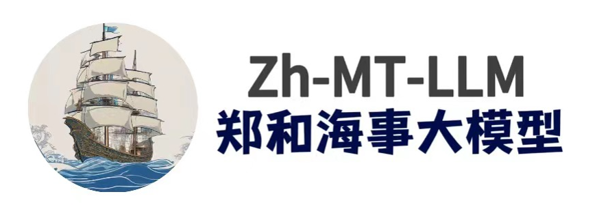

<div align="center">

[ZH](./README.md)| EN

<h1>Zheng He Maritime Large Language Model (Zh-MT-LLM)</h1>



[](./LICENSE)
[](https://huggingface.co/ZhangFuXi/Zh-MT-LLM)
[]()
[](http://i-1.gpushare.com:40692/)

</div>

Zheng He Maritime Large Language Model (Zh-MT-LLM) is a vertical domain maritime Large Language Model developed by the Intelligent Technology Laboratory of Dalian Maritime University for practitioners, trainers and students in the maritime field, providing questions and answers on maritime laws and regulations, maritime education and training, and questions and answers on maritime expertise.

Corresponding to the above three segments, our model has the following three main characteristics:

- Maritime Laws and Regulations Q&A: The model learns from a large number of maritime-related laws and regulations content involving the maritime field, and can provide consulting services for people related to the maritime field. Part of the training data comes from a total of 1.4w maritime-related laws and regulations, covering international conventions, maritime laws, documents of the State Council, documents of ministries and commissions, administrative regulations, documents of the Maritime Safety Administration, and judicial interpretation documents.
- Maritime Education and Training: Firstly, the model learns a part of the education knowledge in the maritime field from the maritime professional test questions originating from the Internet and textbooks. Secondly, we use various maritime vocational examination syllabi, including 《Marine Crew Examination Syllabus》, 《Ship Carrying Dangerous Goods Declarant Examination Syllabus》and 《Dangerous Goods Container Container On-site Inspector Examination Syllabus》, to generate a large amount of maritime job training knowledge to train the model. In addition, the model also learns a part of high-quality crew common question and answer knowledge for trainers to answer questions and solve puzzles.
- Maritime Expertise Q&A: for ships, ports, oceans, navigation and other maritime professional fields, the model study involves ship maintenance, ship safety management, port operation and management, maritime logistics, maritime security, navigation technology, marine environmental protection, marine scientific research related knowledge, can provide all kinds of professional practitioners in the maritime industry to answer the questions and solve the puzzles.

This project will successively open source a series of **Maritime domain command fine-tuning data** and **Maritime large language model weights** to help the research of maritime large language model.

## News ✨

[2023/12/18] Official release of the Zhenghe Maritime Large Language Model (Zh-MT-LLM) and open source of the [Zh-MT-LLM v1.0 model](https://huggingface.co/ZhangFuXi/Zh-MT-LLM/tree/main), as well as the [LoRA model weights]( https://huggingface.co/ZhangFuXi/Zh-MT-LLM/tree/main/Zh-MT-LLM-lora) for this version 


## Examples

#### Maritime Laws and Regulations Q&A

| questions | Zh-MT-LLM |
| -------------------------------------------------------- | :----------------------------------------------------------- |
| What is the SOLAS Convention? What are the requirements related to mobile operations at sea?        | The SOLAS Convention stands for the International Convention for the Safety of Life at Sea, an important convention developed by the International Maritime Organization (IMO) to ensure the safety of ships and crews at sea. It is an important convention developed by the International Maritime Organization (IMO) to ensure the safety of ships and crews at sea. the SOLAS Convention also imposes relevant requirements on mobile operations at sea (e.g. satellite communications, radio stations, etc.). \n\nSpecifically, the SOLAS Convention stipulates the necessary equipment that ships must be equipped with, including satellite communication equipment, radios, radar, automatic identification systems, etc. The SOLAS Convention also stipulates that ships must be equipped with the necessary equipment, including satellite communication equipment, radios, radar, and automatic identification systems. In addition, the convention also stipulates that vessels must undergo regular maintenance and inspection to ensure the proper functioning of such equipment. \n\nIn addition, the SOLAS Convention also stipulates the necessary personnel that ships must have, including captains, crew members, communicators, and so on. These personnel must receive appropriate training to ensure that they are proficient in operating and maintaining the equipment and are able to take appropriate measures in case of emergency. \n\n In conclusion, the SOLAS Convention imposes stringent requirements on maritime mobile operations aimed at ensuring the safety of vessels and crews. The implementation of these requirements is essential to ensure the safety of maritime communications and transportation. |
| Please explain the main content and scope of application of the Scheme on Points for Seafarers' Violations.         | The Measures for Recording Points for Seafarers' Violations of the Law is a regulation issued by the China Maritime Safety Administration (CMSA), which aims to record points for seafarers' violations of the law, and to stipulate the corresponding point-recording standards and penalties. Its main contents include:\n\n1. Demerit Points Standard and Penalty Measures: Crew members will be given demerit points for violations, and the value of demerit points will be different depending on different violations. After the demerit points reach a certain level, the crew will face corresponding penalties, including fines, suspension of license, revocation of license, etc. \n\n2. Demerit points cycle: The demerit points cycle for crew members is one year, starting at the beginning of each year and ending on the same day of the following year. \n\n3. Points Record and Enquiry: The points record of a crew member will be kept permanently and can be enquired through the official website of China Maritime Safety Administration. \n\n4. Appeal against demerit points: Crew members can appeal against demerit points within a certain period of time, and the result of the appeal will be adjudicated by the Maritime Safety Administration of China (MSAC). \n\nScope of application: The Measures on Demerit Points for Seafarers' Violations are applicable to all seafarers engaged in seafaring activities within the territory of China, including seafarers, masters and crew members. |
| What should the crew on watch of an engine do if they notice a leakage of oily water in the engine room while performing their duties? | According to the "Rules of the People's Republic of China on Crew Duty of Inland Waterway Vessels", engineers on duty should pay attention to the leakage of bilge oil and sewage at all times. If an engine duty crew member discovers a leakage of engine room oily water while performing his duties, he should take immediate measures to deal with it. \n\nFirst, he should immediately report the situation to the chief engine officer and provide a detailed description of the spillage. The Engineer-in-Charge will give appropriate instructions according to the situation, such as stopping the operation, adjusting the ship's attitude, etc., to prevent further contamination. \n\nSecondly, the Engineer on duty should take measures to deal with the emergency as soon as possible. He may try to use appropriate equipment for the collection and treatment of oily sewage, such as oil-water separators and oil-water recovery devices. At the same time, he can also try to use oil-absorbing materials for the adsorption and removal of oily sewage. \n\nFinally, the duty engineman should closely monitor the treatment of oily water in the engine room and report the progress of treatment to the chief engineer in a timely manner. The Chief Engineer will adjust the treatment program according to the situation and ensure that the engine room oily water is effectively treated in order to avoid pollution to the environment. \n\\n In conclusion, the duty engineers should take immediate measures to deal with the leakage of engine room oily water when it is detected and report the situation to the Chief Engineer to ensure that the engine room oily water is dealt with in a timely manner in order to protect the environment and the safety of the ship. |


#### Maritime Education and Training

| questions                                                    | Zh-MT-LLM                                                    |
| ------------------------------------------------------------ | ------------------------------------------------------------ |
| What type of extinguishing agent does Smoke and Embers IG-541 belong to? | IG-541 is a clean gas fire extinguishing agent, which belongs to the category of inert gas fire extinguishing agent. It consists of nitrogen, carbon dioxide and argon, and extinguishes fires by removing oxygen from the air. This extinguishing agent is safe for the environment and human body, and does not leave any residue. |
| How to wear and use protective clothing correctly to ensure the safety of seafarers? | Protective clothing plays a vital role in the maritime sector by protecting seafarers from harmful substances, hazardous environments and infectious diseases. Here are a few key steps for the correct donning and use of protective clothing:\n\n1. Understand the type of protective clothing: Depending on the task and the environment, protective clothing can be categorized into a number of types, such as protective gloves, gowns, goggles, respirators, and so on. Seafarers should be aware of the different types of protective clothing and select protective equipment suitable for the particular task. \n\2. Inspection and maintenance: Before using protective clothing, seafarers should carefully inspect its appearance and integrity. Any protective clothing that is torn, damaged or not up to standard should be eliminated. In addition, protective clothing should be maintained and cleaned regularly to ensure its performance and protection. \n\n3. wear correctly: Seafarers should wear protective clothing correctly in accordance with the instructions for its use. This may include wearing gloves, goggles, respirators, etc. It should be worn for comfort and fastening to ensure that the suit protects the body effectively. \n\n4. use the correct accessories: seafarers should use the correct accessories such as protective gloves, goggles, respirators etc. These accessories should be matched to the protective clothing to ensure optimum protection. \n\5. Replace regularly: Protective clothing has a limited lifespan and seafarers should replace their protective clothing on a regular basis. In general, the replacement cycle of protective clothing depends on its frequency of use, environmental conditions and level of protection. Seafarers should replace protective clothing as often as necessary to ensure its effectiveness. \n\n In conclusion, the correct wearing and use of protective clothing is an important step for seafarers to protect their safety. Seafarers should be aware of the type and function of protective clothing, wear and use it correctly, and change it regularly to ensure its effectiveness and safety. |
| I have heard that the third mate's examination results can be used as the examination results of the sailor on duty, how is it exactly? | According to the "Rules of the People's Republic of China for the Competency Examination and Certification of Seafarers", the third mate's examination result can be used as the examination result for the duty seaman, but only if the third mate's examination result is qualified. Specifically, according to the provisions of the Rules, the third mate's examination results can be used as the examination results of the duty seaman if the third mate's examination results are qualified. |
| The following is a multiple choice question, please give your answer \nBill of Lading is a document used to prove the contract of carriage by sea and the taking over or loading of the goods by the carrier, as well as the carrier's guarantee to pay for the goods on the basis of it, and is an important legal document in liner transportation. The following statements about the bill of lading are correct: \nA. The bill of lading is only the proof of the contract of carriage rather than the contract of carriage itself \nB. The bill of lading is only prima facie evidence of the carrier's receipt of the goods when it is in the hands of the shipper, and if the carrier has solid proof that the goods it receives do not conform to the entries on the bill of lading, the carrier may raise objections with the shipper. However, for the transferee of the bill of lading, the bill of lading becomes final evidence \nC. Banks generally only accept a loaded bill of lading, i.e., a bill of lading issued by the master of the ship or by the carrier's agent after the goods have been loaded onto the designated ship D. The date of loading of the ship stated in the bill of lading that is earlier than the date of actual loading is known as an advance borrowing bill of lading | A. A bill of lading is only a proof of the contract of carriage rather than a contract of carriage per se \n\nB. The bill of lading, while in the hands of the shipper is only prima facie evidence of the carrier's receipt of the goods, if the carrier has solid evidence that the goods it receives do not conform to what is stated on the bill of lading, the carrier may object to the shipper. But for the transferee of the bill of lading, the bill of lading becomes conclusive evidence \n\nC. Banks generally only accept a loaded bill of lading, i.e., a bill of lading issued by the master of the ship or by the carrier's agent after the goods have been loaded onto the designated ship |


#### Maritime Expertise Q&A

| questions | Zh-MT-LLM |
| ------------------------------------------------------------ | ------------------------------------------------------------ |
| What are the relevant terms commonly used in ship handling? Please list and explain their meanings.         | What are the relevant terms commonly used in ship maneuvering: \n\n1. rudder angle: the angle of rotation of the tiller or rudder wheel, usually expressed in degrees. \n\n2. rudder speed: the speed at which the rudder angle changes, usually expressed in degrees per minute. \n\n3. ship's speed: the distance traveled by a ship in a unit of time, usually expressed in nautical miles per hour. \n\n4. Heading: The direction of a ship relative to the ground, usually expressed in degrees. \n\n5. Rudder Angle Command: refers to the change in rudder angle required by the ship's maneuvering crew, usually expressed in degrees. \n\n6. rudder angle feedback: the position of the tiller or rudder wheel after a change in rudder angle, usually expressed in degrees. \n\n7. ship's speed feedback: the difference between the actual speed the ship is traveling and the ship's speed, usually expressed in nautical miles per hour. \n\n8. heading feedback: the difference between the ship's actual heading and the heading command, usually expressed in degrees. \n\n9. Rudder Angle Adjustment: refers to the adjustment made by the ship's maneuvering officer to the change in rudder angle in order for the ship to travel as instructed. \n\n10. Rudder Angle Adjustment: This refers to the adjustment made by the ship's operator to the change in rudder angle to enable the ship to travel in accordance with the instructions and to prevent the ship from being affected by factors such as wind and waves. |
| What is the importance of static electricity knowledge in tanker transportation and how to deal with it?               | Static electricity is a very important issue in tanker transportation because tankers generate a lot of static electricity when loading and unloading oil. Static electricity can cause fires and explosions, so appropriate measures must be taken to prevent the generation and accumulation of static electricity. \n\nThe following are some of the common ways in which static electricity is generated and accumulated: \n\n1. friction and collision of oil during loading and unloading. \n\n2. flow of oil in pipelines and tanks. \n\n3. the flow of oil in the tanker's bilge. \n\n4. metallic structures and other electrically conductive materials in the tanker's hold. \n\nThe following are some countermeasures: \n\n1. use of anti-static materials and equipment such as anti-static floors, anti-static mats, anti-static gloves, anti-static clothing, etc. \n\n2. use anti-static grounding devices to conduct static electricity to the ground when loading and unloading oil. \n\n3. installing anti-static devices such as anti-static tanks, anti-static pumps, etc., in the tanker holds \n\n4. installing anti-static coatings in tanker holds, e.g. anti-static coatings, anti-static paints, anti-static coatings, etc. \n\n5. Installation of anti-static piping and tanks in the tanker's hold to minimize the accumulation of static electricity. \n\n6. installing anti-static equipment such as anti-static pumps, anti-static valves, etc. in the tanker's hold to minimize the generation of static electricity. \n\n7. install anti-static grounding devices in the tanker cabins to channel static electricity to the ground. \n\nSummary, static electricity is a very important issue in tanker transportation, and appropriate measures must be taken to prevent the generation and accumulation of static electricity. |
| How to use radar correctly for collision avoidance?                                   | Radar is a very important navigational tool on board a ship to help the crew identify other ships, obstacles and dangerous areas. When navigating at sea, it is very important to use radar correctly for collision avoidance. Here are some tips for using radar for collision avoidance:\n\n1. Set the proper radar range: the radar range should be set according to the size of the ship and its surroundings. If the ship is too small, the radar range should be set to a smaller range to minimize interference and errors. \n\n2. monitor the radar screen: during the voyage, the crew should always monitor the radar screen to stay alert. If other vessels or obstacles are detected, immediate action should be taken. \n\n3. recognizing targets: on the radar screen, the crew should be able to recognize other vessels or obstacles. This can be done by observing the echoes on the radar screen. If the target is too far away, the crew should try to increase the radar range to better identify the target. \n\n4. Calculating Distance and Speed: The crew should be able to calculate the distance and speed of other vessels or obstacles from themselves. This can be done by looking at the distance and speed information on the radar screen. \n\n5. take action: if another vessel or obstacle is sighted, the crew should take immediate action. This may include changing course, speed or distance from the target. The crew should always be alert and ready to take action. \n\n In conclusion, the proper use of radar for collision avoidance requires good observation and judgment on the part of the crew. The crew should always be alert and ready to act at all times. |
| What is a VTS (Vessel Traffic Service) system and what is its role in maritime safety? | A VTS (Vessel Traffic Service) system is a system used to monitor and manage vessel traffic. It uses radar, IS (Automatic Identification System) and other sensors to track information such as a ship's position, heading and speed, and to provide real-time ship traffic information and advice.VTS systems can help ships to avoid collisions, optimize the flow of ship traffic, improve ship safety and reduce emissions. In addition, VTS systems can provide assistance and rescue services in emergency situations. |


## Model evaluation ##

In order to more comprehensively compare the performance difference between the Zhenghe Maritime Large Language Model (Zh-MT-LLM) and the General Domain Large Language Model within the maritime domain. We constructed two evaluation datasets, Zh-eval-opt and Zh-eval-qa, from two perspectives, objective and subjective questions.

### Objective question evaluation

The Zh-eval-opt objective question assessment dataset contains 800 multiple choice questions. The questions cover as wide a range of specialties in the maritime field as possible, and also include questions related to crew training. We use Accuracy to compare the performance of the model on this dataset.

#### Evaluation Results

|    Models     | Parametric Quantity |   Acc    |
| :-----------: | :-----------------: | :------: |
| Baichuan-Chat |         7B          |   37.4   |
|   ChatGLM3    |         6B          |   34.5   |
|   Qwen-Chat   |         7B          |   37.6   |
|   Atom-Chat   |         7B          |   31.2   |
|   Zh-MT-LLM   |         6B          | **41.0** |

​													Table 1: Results of Objective Question Assessment

### Subjective evaluations

Zh-eval-qa has a data size of 2000. contains 600 questions and answers on maritime laws and regulations, 600 questions and answers on maritime education and training, and 800 questions and answers on maritime professional knowledge. The subjective questions are evaluated using GPT-3.5-Turbo automated evaluation to compare the model performance.

The automated assessment uses the reference material as the baseline answer and scores the answers given by each model in terms of completeness, accuracy, and clarity of organization or lack thereof, with a score range of 1-5. The composite score was calculated as $0.4*accuracy + 0.3*(completeness + clarity)$.

#### Evaluation Results

| Models | Parametric Quantity | Accuracy | Completeness | Clarity | Composite Score |
| :-----------: | :----: | :------: | :------: | :------: | :------: |
| Baichuan-Chat | 7B | 4.06 | 3.67 | 4.14 | 3.97 |
| ChatGLM3 | 6B | 4.09 | 3.65 | **4.16** | 3.98 |
| Qwen-Chat | 7B | 3.37 | 3.34 | 3.60 | 3.43 |
| Atom-Chat | 7B | 3.97 | 3.52 | 3.88 | 3.81 |
| Zh-MT-LLM | 6B | **4.32** | **3.82** | 4.13 | **4.11** |

​														 Table 2: Results of the subjective assessment														

## Reasoning and deployment

1. Download the contents of this repository to a local/remote server

```
git clone https://github.com/ITRECLab/Zh-MT-LLM.git
```

2. Creation of a conda environment

```shell
conda create --name zh-mt-llm python=3.9
conda activate zh-mt-llm
```

3. Installation of dependencies

```shell
cd Zh-MT-LLM
pip install -r requirements.txt
```

4. Download [Full parametric model weights](https://huggingface.co/ZhangFuXi/Zh-MT-LLM) and optionally [LoRA model weights](https://huggingface.co/ZhangFuXi/Zh-MT-LLM/tree/main/Zh-MT-LLM-lora) if there is a local ChatGLM3-6b-base model weight.

5. Use the following code for reasoning:

```python
import torch
import argparse
from transformers import AutoModelForCausalLM, AutoTokenizer,AutoModel
from peft import PeftModel
# Argument Parser Setup
parser = argparse.ArgumentParser()
parser.add_argument("---model", type=str, default="ZhangFuXi/Zh-MT-LLM",
                    help="The directory of the model")
parser.add_argument("---tokenizer", type=str, default="ZhangFuXi/Zh-MT-LLM", help="Tokenizer path")
parser.add_argument("--adapter", type=str, default=None,
                    help="Path to the LoRA model checkpoint")
args = parser.parse_args()

if args.tokenizer is None: if args.tokenizer is None.
    args.tokenizer = args.model
# Load the mod
model = AutoModelForCausalLM.from_pretrained(
    args.model,
    trust_remote_code=True,
    low_cpu_mem_usage=True,
    torch_dtype=torch.float16,
    device_map='auto'
)
# Load adapter
if args.adapter is not None: if args.adapter is not None.
    model = PeftModel.from_pretrained(model, args.adapter)
# Load tokenizer
tokenizer = AutoTokenizer.from_pretrained(args.tokenizer, trust_remote_code=True)
model = model.eval()
meta_instruction = "You are Zheng He, ITREC Lab Development, an expert in the maritime field. Please provide as much help as possible to the users. Be careful to use safe words and don't do anything illegal. \n"
user_input = "Hello."
prompt = meta_instruction + user_input
response, history = model.chat(tokenizer, prompt, history=None)
print(response)
``


```


## Model training ##

The Zhenghe Maritime Large Language Model (Zh-MT-LLM) selects [ChatGLM3-6B-base](https://github.com/THUDM/ChatGLM3) as the base model, which has the strongest performance among the base models below 10B. In order to improve the model results and have high fine-tuning efficiency, we chose to use QLoRA to perform instruction fine-tuning on 2*A800GPUs. The fine-tuning code refers to the [Firefly](https://github.com/yangjianxin1/Firefly) project to execute the following commands:

```shell
torchrun --nproc_per_node=2 train_qlora.py --train_args_file train_args/qlora/chatglm3-6b-sft-qlora.json
```


The main parameters used for fine tuning are as follows:

```json
{ 
    "num_train_epochs": 2,
    "per_device_train_batch_size": 20,
    "gradient_accumulation_steps": 2,
    "learning_rate": 0.0002,
    "max_seq_length": 1024,
    "logging_steps": 20,
    "save_total_limit": 10,
    "lr_scheduler_type": "constant_with_warmup",
    "warmup_steps": 0.1,
    "lora_rank": 64,
    "lora_alpha": 32,
    "lora_dropout": 0.05,
    "weight_decay": 0,
    "max_grad_norm": 0.3,
}
``
```

​																

## Training data

The training data use the maritime domain data Zh-mt-sft organized for three main segments, and 30w general conversation data [moss-003-sft-data](https://huggingface.co/datasets/fnlp/moss-003-sft-data). Zh-mt-sft specifically Contains CrimeKgAssitant-1.8w, Zh-law-qa, and Zh-law-court related to maritime laws and regulations Q&A, Zh-edu-qa and Zh-edu-qb related to maritime education and training, and Zh-mt-qa related to maritime specialized knowledge Q&A.

The instruction fine-tuning dataset Zh-mt-sft is constructed as follows:

#### Maritime Laws and Regulations Q&A

The Maritime Laws and Regulations Q&A section contains a total of three services:

- Consultation on Maritime Laws and Regulations
- The Court consider
- Judgement prediction

In order to provide consulting services on the laws and regulations that characterize the maritime domain, this project collected a total of **1.4w** maritime-related laws and regulations, covering international conventions, maritime laws, documents of the State Council, documents of ministries and commissions, administrative regulations, documents of the Maritime Safety Administration, and documents of judicial interpretations, and so on. Based on the information collected above, we designed and iterated the prompt words, and generated a total of **5.9w** maritime laws and regulations advisory data using **GPT-3.5-Turbo **. From these, we extracted **1.3k** pieces of legal advice data involving maritime law, which were rewritten by maritime law professionals to align human preferences while enhancing the professionalism of the responses. In addition, we cleaned and filtered **1.8w** pieces of higher quality data from the **CrimeKgAssitant** dataset of legal advice in real-world scenarios to increase the generalizability of legal advice.

The court opinion and judgment prediction part totaled **5.6k** pieces of data, collected from real judicial cases related to maritime affairs in the NLM website. The case information description part is intercepted as the input, and the content of court opinion and court judgment are used as the output of the two operations respectively.

#### Maritime Education and Training

Maritime education and training consists of two major services:

- Maritime Specialty Question Bank
- Maritime Education Counseling

Maritime professional question bank collected from the network as well as the school of all kinds of maritime-related professional question bank, which contains a part of the online collection of crew certification related test questions, a total of **2.3w** articles.

The Maritime Education Consultancy Service provides specialized knowledge-related educational consultancy services for various types of trainers in the maritime field and maritime students. The data comes from three parts: in the first part, we collected the examination syllabi for trainers in the maritime field, such as the Examination Syllabus for Seafarers and the Examination Syllabus for Persons Engaged in the Carriage of Dangerous Goods by Vessel in and out of Ports and Declarations. Based on the knowledge points in the syllabus, we designed and iterated the cue words and generated **2.2w** pieces of data using GPT-3.5-Turbo. In the second part, we collected a total of **1k** pieces of high-quality crew general knowledge quiz data from the Internet. In the third part, we reconstructed the Q&A using GPT-3.5-Turbo for a part of the questions in the question bank that involved specialized knowledge according to the following principles:

- Responses should continue to be fleshed out based on the content of the answer options.
- Rewritten questions need to relate to the correct answer for that topic.
- No description of the original multiple choice/judgment question type can appear in the question, or in the response.

In the end, we filtered out **1.6w** of these high-quality data to add maritime domain expertise to the consultation data.

#### Maritime Expertise Q&A

For this part of the data we first designed and iterated the cue words using two methods to obtain the data, one in the form of GPT-3.5-Turbo self-questioning and one in the form of GPT-3.5-Turbo asking questions that GPT-4.0-Turbo answers. For the **7.2w** pieces of data generated through the above two methods, we retained **4.6w** pieces of high-quality data for fine-tuning after cleaning and filtering.

The specific statistics of the dataset used for the above training are as follows:

<table>
    <tbody style="text-align: center;">
    <tr>
        <th>Services</th>
        <th>Subtasks</th>
        <th>Data sets</th>
        <th>Data volume</th>
    </tr>
    <tr>
        <td rowspan="4">Maritime Laws and Regulations Q&A</td>
        <td rowspan="2">Maritime Legal Advice</td>
        <td>CrimeKgAssitant </td>
        <td>18,279</td>
    </tr>
    <tr>
        <td>Zh-law-qa</td>
        <td>59,244</td>
    </tr>
    <tr>
        <td>The Court held</td>
        <td>Zh-law-court</td>
        <td>2,684</td>
    </tr>
    <tr>
        <td>Sentence projections</td>
        <td>Zh-law-predict</td>
        <td>3,004</td>
    </tr>
    <tr>
        <td rowspan="2">Maritime education and training</td>
        <td>Maritime Education Counseling</td>
        <td>Zh-edu-qa</td>
        <td>41,052</td>
    </tr>
    <tr>
        <td>Maritime Specialization Question Bank</td>
        <td>Zh-edu-qb</td>
        <td>23,531</td>
    </tr>
    <tr>
        <td rowspan="4">Maritime Expertise Q&A</td>
        <td>Ship Knowledge</td>
        <td rowspan="4">Zh-mt-qa</td>
        <td rowspan="4">46,759</td>
    </tr>
        <tr>
        <td>Navigational Knowledge</td>
    </tr>
        <tr>
        <td>Port knowledge</td>
    </tr>
        <tr>
        <td>Marine knowledge</td>
    </tr>
        <tr>
        <td rowspan="1">Generic Dialogue</td>
        <td></td>
        <td>moss-003-sft-data</td>
        <td>300,000</td>
    </tr>
        <tr>
        <td>Total</td>
        <td colspan="3">494,553</td>
    </tr>
    </tbody>
</table>

​																	Table 3: Training data statistics

## Declaration

Due to factors such as the limitation of the number of model parameters and the degree of cleaning of the training data, the model open source in this project may have the following limitations:

- Because it has not been harmlessly fine-tuned, it may result in discriminatory, harmful and unethical statements.
- Lacking an accurate understanding of the real world, the model may produce hallucinatory responses that mislead the user.
- The model's training data may contain biased data, and users should be cautious about potential bias in model responses.

- Due to the limited number of model parameters, it may not be possible to cover all areas of knowledge, resulting in less accurate or complete responses on some topics.

- When dealing with factual knowledge in a specific domain, models may provide incorrect answers due to insufficient information or misinterpretation, leading to misinformation or confusion.

Given the limitations of the above model, we request that the code, data, and model of this project not be used for socially harmful purposes and must follow the [MODEL_LICENCE](https://github.com/THUDM/ChatGLM3/blob/main/MODEL_LICENSE) of the base model. We are not responsible for any problems, risks, or adverse consequences arising from the use of Zh-MT-LLM.

## Development team

Zheng He Maritime Large Language Model (Zh-MT-LLM) is developed by the Large Language Model Project Team of Intelligent Technology Laboratory (ITREC) of Dalian Maritime University.

Academic advisor: Yijia Zhang, Mingyu Lu, Guoqiang Li, Houqun Xing

Student members: Fuxi Zhang, Shengbo Fu, Yiming Zhou , Bingyu Wan , Junwei Zhang , Songtao Li , Shidi Zhang, Shilong Wang , Junkai Cheng , Weiming Yin , Qinghua  Pei , Xiaobo Li , Qiyun Zhao , Chengquan Pu, Weihao Sun , Zhenxin Li , Jinfan Wang , Yufan  Jiang , Lin Sun , Jinzhu Guan , Shuai Chang, Ziyi Ma , Chang Wang, Shuai Chen 

Cooperation e-mail: zhangyijia@dlmu.edu.cn

## Acknowledgements

Chinasys Technologies Co . , Ltd. Dalian Branch, and the High Performance Computing Center of Dalian Maritime University for their support and help, as well as the following open source projects for their inspiration and help with this project:

- [ChatGLM3](https://github.com/THUDM/ChatGLM3)
- [Taiyi](https://github.com/DUTIR-BioNLP/Taiyi-LLM)
- [Firefly](https://github.com/yangjianxin1/Firefly)
- [DISC-LawLLM](https://github.com/FudanDISC/DISC-LawLLM)
- [CrimeKgAssitant](https://github.com/liuhuanyong/CrimeKgAssitant)
- This project Logo was generated by DALL-E 3 and then manually modified.

## Star History

[](https://star-history.com/#ITREC/Zh-MT-LLM&Date)
